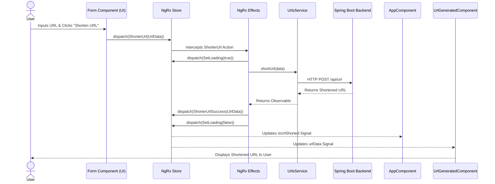

# URL Shortener Frontend Documentation

## Architecture Overview

This application is built with Angular and heavily utilizes its modern capabilities, specifically Standalone Components and the new Signals API for reactive state management. The user interface applies the Kubuntu Plasma 6 "Breeze" Dark design aesthetic, which emphasizes deep grey backgrounds, translucent overlays, rounded UI elements, and sharp blue accent colors.

### State Management
State is handled centrally via NgRx (`@ngrx/store` and `@ngrx/effects`). We bridge this state to our components using Angular's `selectSignal()` which allows us to eliminate RxJS `Subscription` code inside our components entirely, making them cleaner and less prone to memory leaks.

## Application Data Flow

The following Mermaid diagram outlines the data flow in the frontend, demonstrating what happens when a user attempts to shorten a URL:

## Styling (Kubuntu Plasma 6 Inspired)

The design system is defined in `styles.scss` and overrides the default Angular Material theme to provide:
- `Glassmorphism`: Translucent background on cards with backdrop blur.
- `Dark Mode Base`: Rich dark gray palette (`#232629`).
- `Accents`: Distinctive Breeze blue (`#3daee9`) for calls to action.
- `Typography`: Clean `Inter` typeface.
